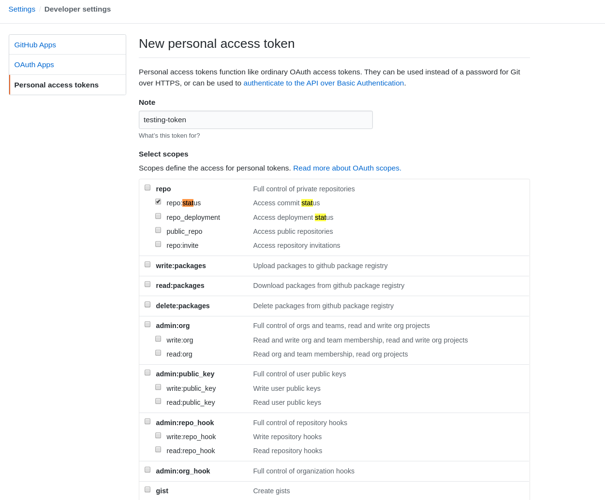

# Setting up to Push GitHub commit-statuses

## Prerequisites

You'll need this operator, and Tekton installed see the installation
[instructions](../README.md#installing).

And you'll need a GitHub auth token.

## Create a secret

Create a secret from your GitHub auth token, this command assumes a token is in `~/Downloads/token`.

Visit https://github.com/settings/tokens/new and create a new personal token:



You'll need to enable the `repo:status` scope.

Click to generate the token, and use the following command to write it to a
file:

```shell
$ echo -n <paste token> > $HOME/Downloads/token
```

```shell
$ kubectl create secret generic commit-status-tracker-git-secret --from-file=$HOME/Downloads/token
```

## Execution

The easiest way to see this in action, is to create a Pull Request against a Git
Repository.

Create a [git resource](https://github.com/tektoncd/pipeline/blob/master/docs/resources.md#git-resource) and set the revision to the SHA of the Pull Request (the head commit).

Execute the `PipelineRun` and view the PR, and the status should be reported.

## Example files

There are a complete set of resources in the [examples](./examples) directory.

NOTE: **You must replace the Repository and SHA entries in the example PipelineRun**

## FAQ

 1. Does this work with `resourceRef`
    *Not yet, this is definitely on my TODO list*.
 1. Can this pull the repository details from a `pullrequest`
    `PipelineResource`?
    *Not yet, again, this is on my TODO list*.
 1. Why don'ty you use labels instead of annotations?
    *Labels can't contain spaces, which are useful in descriptions*
