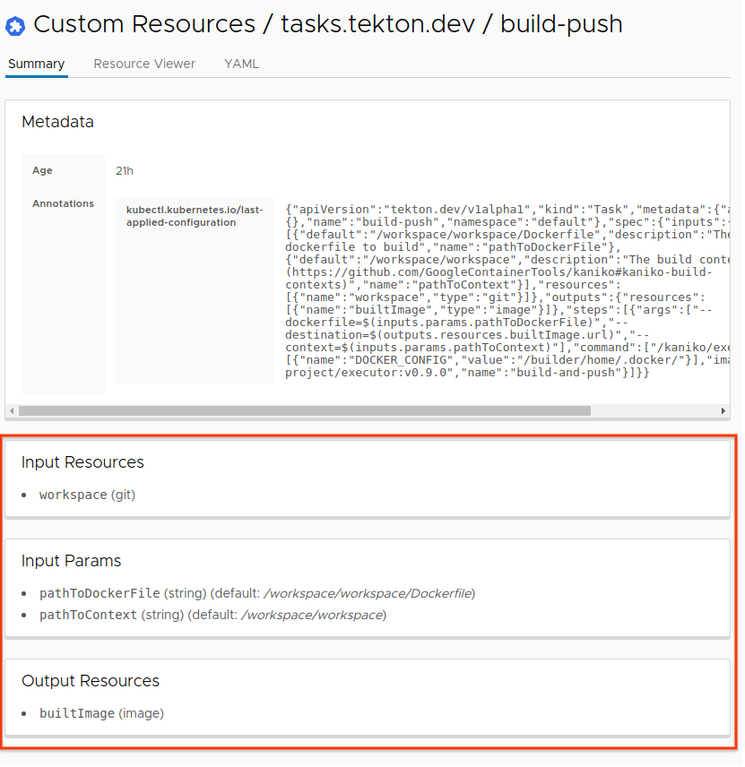
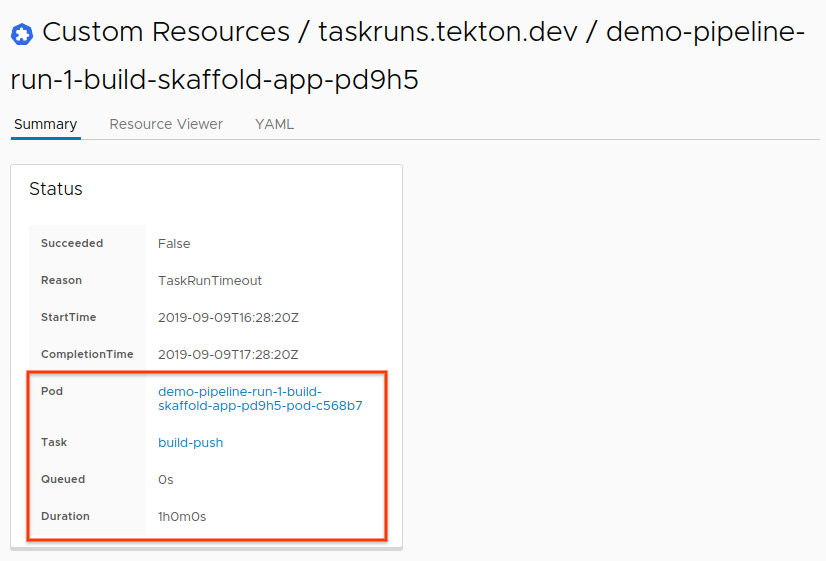
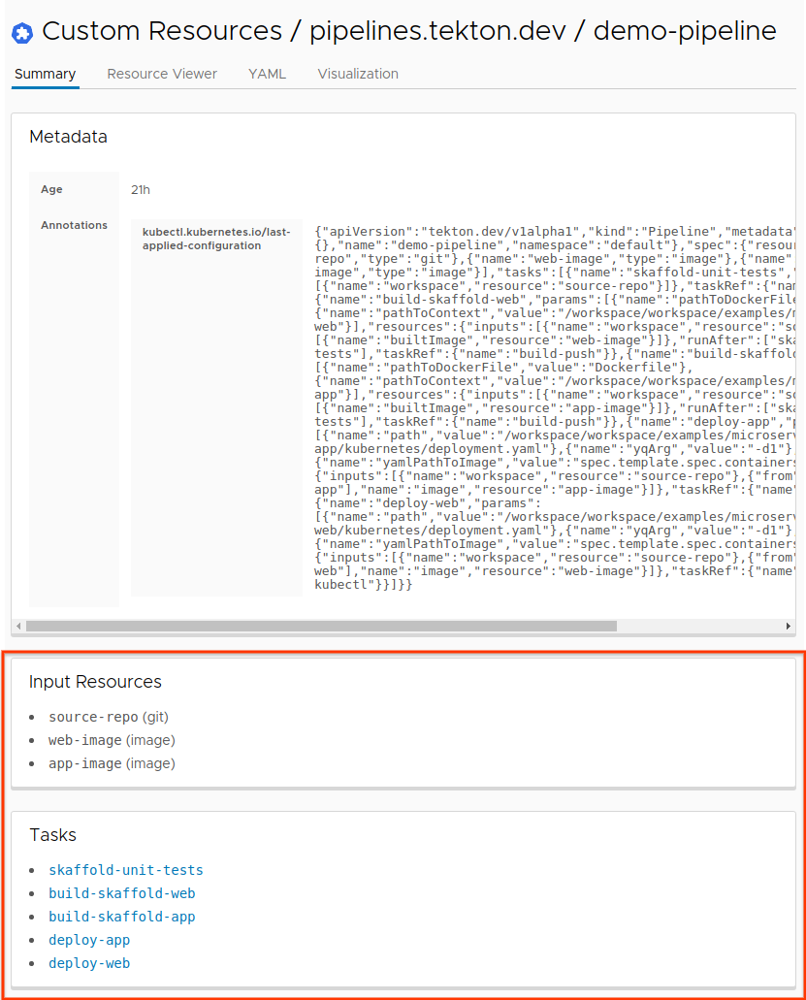
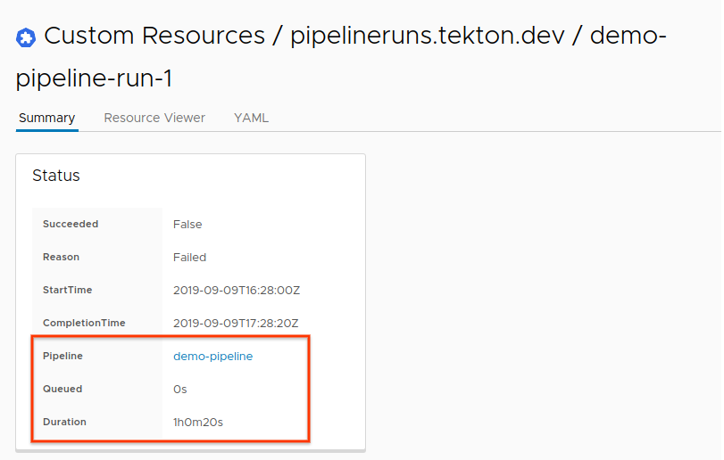

# Tekton Octant Plugin

The Tekton Octant plugin provides a plugin to the Octant dashboard. 
The plugin displays additional useful information about Tekton custom 
resources on your Kubernetes cluster. 

# Using this Plugin

To add this plugin to Octant, clone this repository and run the following in 
the `octant-plugin` folder from this repository:

`go build -o ~/.config/octant/plugins/tekton-plugin ./`

The command above will add the binary for this plugin under `~/.config/octant/plugins/tekton-plugin`. 

If you are running Octant at the time that you add the plugin, you will need to 
restart Octant by stopping Octant and running `octant` from the command line. 

After starting up Octant with the `tekton-plugin`, you will find information about 
Tekton resources on your cluster under the Custom Resources section of the dashboard. 

# Dashboard Visualization

## Task

* Lists input resources and parameters, and output resources
* TODO: links to recent TaskRuns

## TaskRun

* Links Pod status (with logs!), and Task definition
* Displays queued time and duration
* TODO: Graphviz visualization of status

## Pipeline

* Lists input resources and parameters
* Links Task definition
* TODO: Graphviz of Pipeline configuration
* TODO: links to recent PipelineRuns

## PipelineRun

* Links Pipeline definition
* Displays queued time and duration
* TODO: Graphviz visualization of status

# Development and Testing

To make changes to the `tekton-plugin`, simply add your changes and 
run the following to compile and add the new binary to your Octant 
plugins folder: 

`go build -o ~/.config/octant/plugins/tekton-plugin ./`

Then restart `octant` which will open a new browser tab, and you should 
be able to see and test your changes.

# Uninstall

To remove the `tekton-plugin` from your Octant dashboard, you can run 
the following command to the delete the plugin binary:

`rm ~/.config/octant/plugins/tekton-plugin`