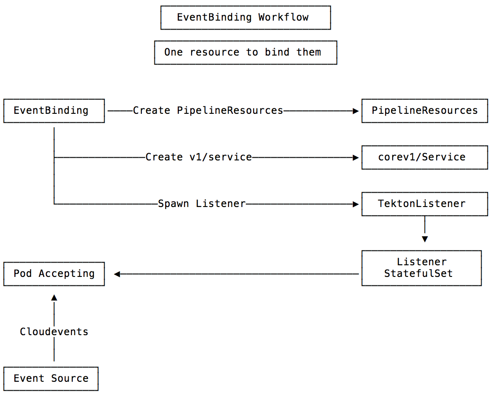
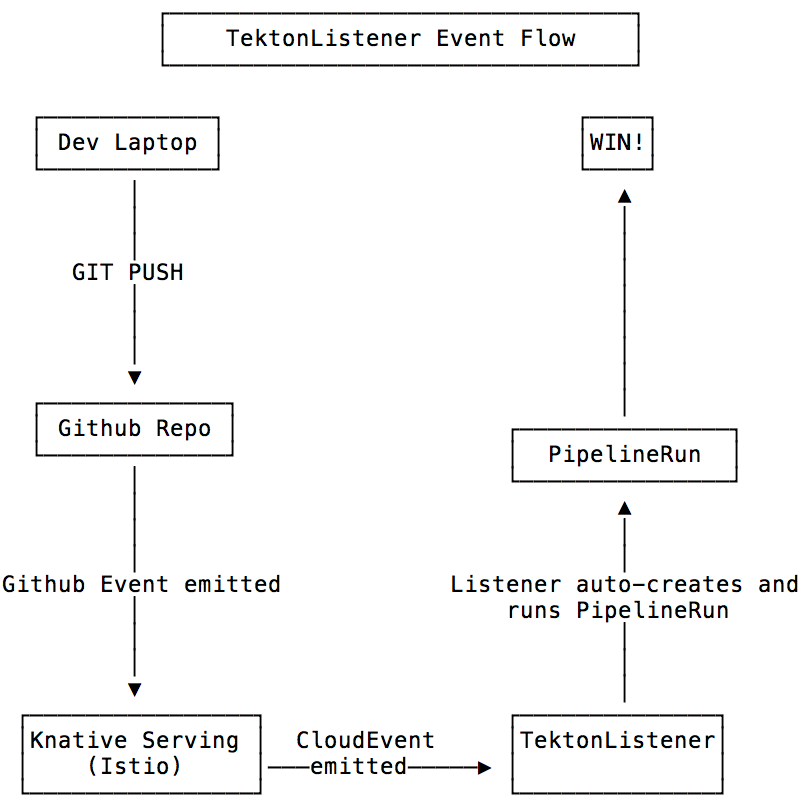

# Getting Started With EventBinding

The best way to demonstrate the `EventBinding` and `TektonListener` resources is to see them in action. We will do this by building a basic CI/CD system and seeing it work.

  * [Requirements](#Requirements)
  * [Experimental Resources](#experimental-resources)
    * [Get Experimental Resources](#get-experimental-resources)
    * [Install Experimental Resources](#install-experimental-resources)
    * [Experimental Resources Explained](#experimental-resources-explained)
  * [Set Up Environment](#set-up-environment)
    * [Pipeline Name](#pipeline-name)
    * [Github ENV Variables](#pipeline-name)
    * [Dockerhub Creds](#dockerhub-creds)
    * [Dockerhub Username](#dockerhub-username)
    * [Base64 Encoded Creds](#base64-encoded-creds)
  * [Create Demo Tekton Resources](#create-demo-tekton-resources)
  * [Setup Demo DNS](#setup-demo-dns)
  * [Create ServiceAccount](#create-serviceaccount)
  * [Create EventBinding](#create-eventbinding)
  * [Create a Service](#create-a-service)
  * [Create an Eventing Source](#create-an-eventing-source)
  * [Round trip](#round-trip)
    * [The Big Picture](#the-big-picture)
    * [Congratulations](#congratulations)

## The plan

We will create:
  - A Tekton Pipeline
  - An EventBinding
  - A GithubSource eventing source
  - And all their dependancies

Once the system is built, we expect to be able to:
  - Push a git commit up to our source repository
  - Watch the system produce an image and run it in our k8s cluster

## Requirements

- [envsubst](https://linux.die.net/man/1/envsubst) - substitutes environment variables in shell format strings
- [A Kubernetes space](https://kubernetes.io/docs/setup/pick-right-solution/) - A Kubernetes cluster accessible from the public internet (not minikube).
- [Knative Serving and Eventing Installed](https://knative.dev/docs/install/) - Knative resources installed.
- [Tekton Pipelines](https://github.com/tektoncd/pipeline/blob/master/docs/install.md) - Tekton Pipelines installed.
- A Github repository to use as your deployment source
  - If you dont have one, you can use [this demo repo](https://github.com/iancoffey/ulmaceae)
- A Dockerhub registry
  - `docker login` needs to succeed
- `ko` installed
  - `go get github.com/google/ko/cmd/ko`

## Experimental Resources

Now that we have a prerequisites covered, we need to install two experimental Resources - `TektonListener` and `EventBinding`.

### Get Experimental Resources

To get the Resources installed, we will clone and apply the experimental manifests.

```
git clone git@github.com:tektoncd/experimental.git && cd experimental/tekton-listener
```

### Install Experimental Resources

Until an official docker repository exists for experimental images, we will need to build the images and push them to our own docker registry.

We need to export our registry for `ko` to use

` export KO_DOCKER_REPO=docker.io/iancoffey`

Now we can use `ko apply` to build, upload and install the components.

`ko apply -f config`

If this succeeds, you should be ready to go.

### Experimental Resources Explained

Lets also talk a bit about what these new Resources do.

#### EventBinding

The Eventbinding resource aims to bind an actual Event with a Pipeline, and create/manage the PipelineResources needed for a Pipeline to function.

The EventBinding also creates a TektonListener to listen for a specified CloudEvent.



#### TektonListener

The TektonListener is another new concept created to solve the issue of connecting Events to Pipelines by listening for and processing CloudEvents and producing PipelineRuns.

TektonListeners can be deployed as a standalone solution but they managed automatically by the EventBinding resource.



## Set Up Environment

### Pipeline Name

Choose a unique name to use for your Pipeline namespace and to identify its resources:

```
export PIPELINE_NAME=ulmaceae
```

### Github ENV Variables

Choose a Github repository for the code we want to build and deploy, like so:

`export GHREPO=iancoffey/ulmaceae`

Finally, we need a Github token to create our `GitHubSource`.

Create these creds inside Github and put the secret and access tokens in two ENV vars:

`export GHACCESSTOKEN=youraccessstoken`

The secret token is just random characters.

`export GHSECRETTOKEN=RANDOMRANDOM`

### Dockerhub Creds

Lastly, we need to export Dockerhub creds so we can push our images there:

#### Dockerhub Username

We need the plaintext dockerhub username:

`export DOCKER_HUB_USERNAME=YOURUSER`

#### Base64 Encoded Creds

We also need the username exported as base64

```
export BASE64_ENCODED_DOCKER_HUB_USERNAME=$(echo -n $DOCKER_HUB_USERNAME | base64)
export BASE64_ENCODED_DOCKER_HUB_PASSWORD=$(echo -n "YOURPASSWORD" | base64)
```

**Make sure to not expose secrets where they might be exploited!**

### Create Demo Tekton Resources

We are going to provision a base Tekton Pipeline as a starting point:

```
envsubst < docs/resources/pipeline.yaml | kubectl apply -f -
```

We just created:
- A new `Pipeline` names `$PIPELINE_NAME`
- Two new `Tasks`:
  - `build-docker-image-from-git-source`
  - `run-using-kubectl`

We will run these resources with our EventBinding.

### Setup Demo DNS

You will need a development domain name to continue.

You will need your DNS names pointed to the address specified in the `service/istio-ingressgateway` for `Knative Serving` to work correctly. This command should make it obvious which ELB CNAME needs to be used.

`k get service/istio-ingressgateway -n istio-system`

We need to create a record for the wildcard DNS name as well. For example, my DNS records are `demo.iancoffey.com` and `*.demo.iancoffey.com` and they point to CNAMEs to my AWS ELB hostname, found with the command above.

Finally, use `knctl` to set our new domain as the default domain:

`knctl domain create --domain=demo.iancoffey.com` --default=true`

Now our `GithubSource` will be able to create a real webhook that resolves to our `TektonListener`.

### Create ServiceAccount

We need a ServiceAccount to authorize our `Pipeline`, `EventBinding` and `TektonListener` to list and create the resources they need.

```
cat <<EOS > manifests/accesstoken.yaml
---
kind: ClusterRole
apiVersion: rbac.authorization.k8s.io/v1
metadata:
  name: \$PIPELINE_NAME-admin
  namespace: \$PIPELINE_NAME
rules:
  - apiGroups: [""]
    resources: ["pods", "namespaces", "secrets", "events", "serviceaccounts", "configmaps"]
    verbs: ["get", "list", "create", "update", "delete", "patch", "watch"]
  - apiGroups: ["apps"]
    resources: ["statefulsets", "deployments"]
    verbs: ["get", "list", "create", "update", "delete", "patch", "watch"]
  - apiGroups: ["tekton.dev"]
    resources: ["tasks", "clustertasks", "taskruns", "pipelines", "pipelineruns", "pipelineresources"]
    verbs: ["get", "list", "create", "update", "delete", "patch", "watch"]
  - apiGroups: ["tektonexperimental.dev"]
    resources: ["tektonlisteners", "eventbindings"]
    verbs: ["get", "list", "create", "update", "delete", "patch", "watch"]
---
apiVersion: v1
kind: ServiceAccount
metadata:
  name: $PIPELINE_NAME-account
  namespace: $PIPELINE_NAME
secrets:
- name: dockerhub-user-pass
---
apiVersion: rbac.authorization.k8s.io/v1beta1
kind: ClusterRoleBinding
metadata:
  name: \$PIPELINE_NAME-admin
  namespace: \$PIPELINE_NAME
subjects:
  - kind: ServiceAccount
    name: \$PIPELINE_NAME-account
    namespace: \$PIPELINE_NAME
roleRef:
  kind: ClusterRole
  name: \$PIPELINE_NAME-admin
  apiGroup: rbac.authorization.k8s.io
EOS
envsubst < manifests/accesstoken.yaml | kubectl apply -f -
```
### Create EventBinding

Now lets create our EventBinding:

```
cat <<EOS > manifests/eventbinding.yaml
apiVersion: tektonexperimental.dev/v1alpha1
kind: EventBinding
metadata:
  name: $PIPELINE_NAME-binding
  namespace: $PIPELINE_NAME
  labels:
    app: $PIPELINE_NAME
spec:
  eventname: pushevents
  eventtype: dev.knative.source.github.push
  serviceAccount: $PIPELINE_NAME-account
  selector:
    matchLabels:
      app: $PIPELINE_NAME
  template:
    metadata:
      labels:
        role: $PIPELINE_NAME
  pipelineRef:
    name: $PIPELINE_NAME-pipeline
  sourceref:
    name: $PIPELINE_NAME-source
  resourceTemplates:
  - name: source-repo
    metadata:
      name: source-repo
      namespace: $PIPELINE_NAME
    spec:
      type: git
      params:
      - name: url
        value: https://github.com/$GHREPO
  - name: image-$PIPELINE_NAME
    metadata:
      name: image-$PIPELINE_NAME
      namespace: $PIPELINE_NAME
    spec:
      type: image
      params:
      - name: url
        value: $DOCKER_HUB_USERNAME/$PIPELINE_NAME
EOS
envsubst < manifests/eventbinding.yaml | kubectl apply -f -
```

You can see we will be creating two PipelineResources, types `git` and `image` - this is done automatically by the `EventBinding`.

### Create a Service

We will use a vanilla `v1/Service` as our Eventing sink, so lets create that Service:

```
cat <<EOS > manifests/service.yaml
apiVersion: v1
kind: Service
metadata:
  name: $PIPELINE_NAME-service
  namespace: $PIPELINE_NAME
spec:
  selector:
    app: $PIPELINE_NAME
  ports:
  - protocol: TCP
    port: 80
    targetPort: 8082
EOS
envsubst < manifests/service.yaml | kubectl apply -f -
```

### Create an Eventing Source

We are going to make use of the `GihubSource` Eventing source to handle the details of accepting Github webhooks and producing CloudEvents. These CloudEvents will flow into a `TektonListener`, which our `EventBinding` will create for us.

First lets create a Secret for our Github secret token and store it in `GHSECRETTOKEN` environment variable. You can create one in your Github developer settings if you dont have one handy. Then, you can create this Secret:

```
cat <<EOS > manifests/githubsecret.yaml
apiVersion: v1
kind: Secret
metadata:
  name: githubsecret
  namespace: $PIPELINE_NAME # knative-sources?
type: Opaque
stringData:
  accessToken: $GHACCESSTOKEN
  secretToken: $GHSECRETTOKEN
EOS
envsubst < manifests/githubsecret.yaml | kubectl apply -f -
```

The `GithubSource` itself is the final puzzle piece.

```
cat <<EOS > manifests/githubsource.yaml
apiVersion: sources.eventing.knative.dev/v1alpha1
kind: GitHubSource
metadata:
  name: $PIPELINE_NAME-ghsource
  namespace: $PIPELINE_NAME
spec:
  serviceAccountName: $PIPELINE_NAME-account
  eventTypes:
    - pull_request
    - push
  ownerAndRepository: $GHREPO
  accessToken:
    secretKeyRef:
      name: githubsecret
      key: accessToken
  secretToken:
    secretKeyRef:
      name: githubsecret
      key: secretToken
  sink:
    apiVersion: v1
    kind: Service
    name: \$PIPELINE_NAME-service
EOS
envsubst < manifests/githubsource.yaml | kubectl apply -f -
```
As we can see, we will be subscribed to Githubs `pull_request` and `push events`.

You should now be able to check in your repositories settings to see the new Webhook your `GithubSource` has created.
Your webhook should be correctly configured to hit your new EventBound Pipeline-based Ci/CD system via your DNS name.

Woop!

## Round trip

All that is left is to try our new CI system by just pushing a commit:

```
git commit -a -m "import antigravity" --allow-empty && git push origin master
```

### The Big Picture

Now we should be able to see our whole system work, end to end. Lets take a look at our state:

If things went well, we can see the PipelineRun created:

`kubectl logs -l app=$PIPELINE_NAME -c tekton-listener -n $PIPELINE_NAME`

Lets check out that PipelineRun(s):

`k get pipelinerun -o yaml -n $PIPELINE_NAME`

So...we should be running our new software!!

`kubectl get pods -l app=$PIPELINE_NAME -n $PIPELINE_NAME`

### Congratulations!!!

Congrats! You have just defined a powerful end-to-end CI/CD solution, only making use of Kubernetes, Knative and Tekton Pipelines.
